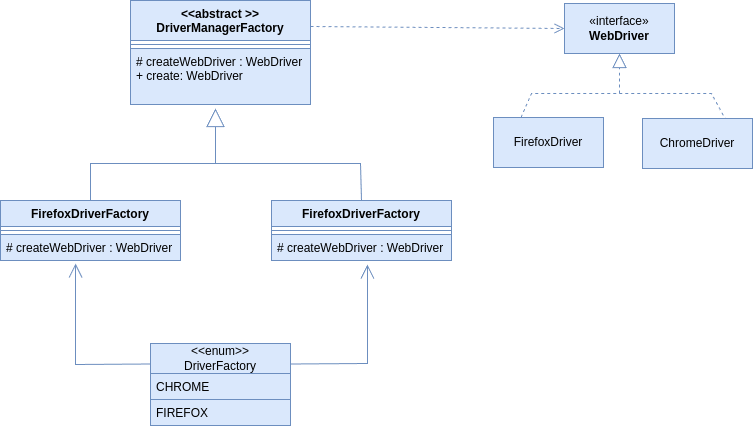

# WebDriver Manager Factory 

Factory Pattern applied to  Selenium WebDriver



Usage:
```sh
String browserOption = System.getProperty("app.browser_driver");
webdriver = DriverFactory.valueOf(Objects.requireNonNullElse(browserOption, "CHROME")).getDriver();
```
For Running  on maven :
```sh
mvn test -Dapp.browser_driver=FIREFOX
```

For browser_driver options see Enum DriverFactory.


#Docker Remote Chrome

Remote uses selenium chrome standalone image
```sh
docker run --rm -it -p 4444:4444 -p 7900:7900 --shm-size 2g selenium/standalone-chrome
```

driver must point to
http://localhost:4444

To see what is happening inside the container, head to http://localhost:7900/?autoconnect=1&resize=scale&password=secret.


